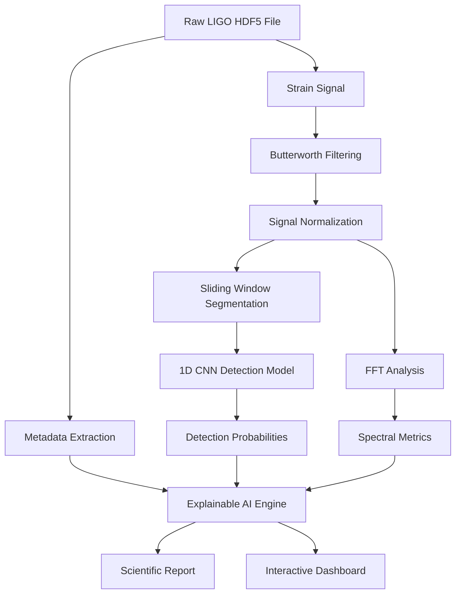
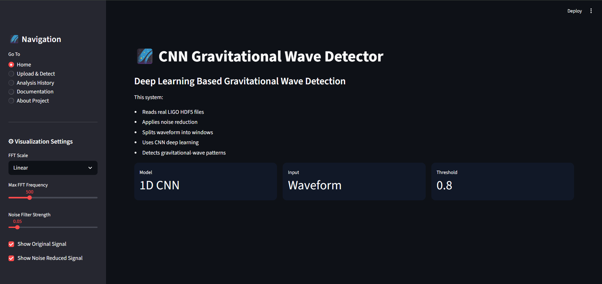
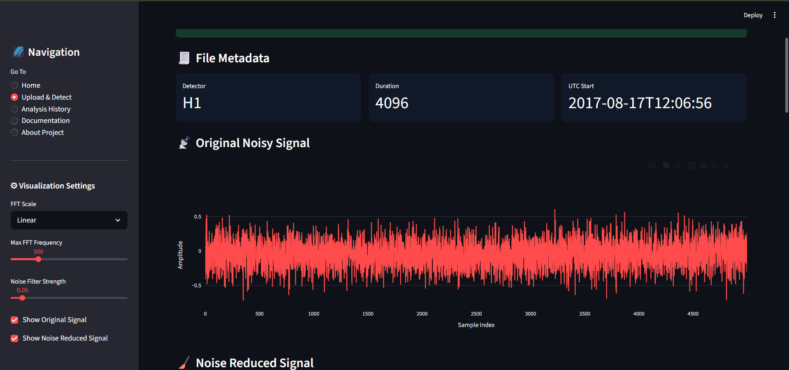
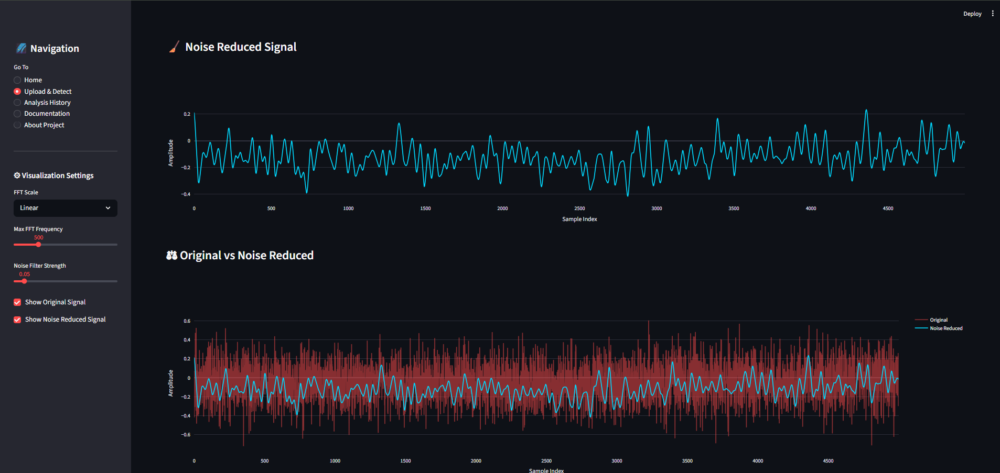
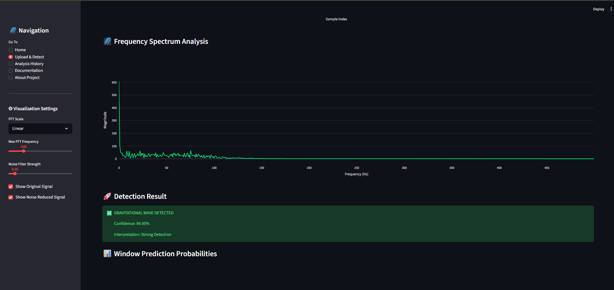

# 🌌 OpenGWAI

<p align="center">
  <h3 align="center">Open Gravitational-Wave Explainable Artificial Intelligence Framework</h3>
  <p align="center">
    Detect • Analyze • Explain Gravitational-Wave Signals with AI
  </p>
</p>

<p align="center">


</p>

<p align="center">


</p>

---

## 📖 Overview

OpenGWAI is an Explainable Artificial Intelligence (XAI) framework for gravitational-wave signal detection, analysis, and scientific interpretation.

The project combines Digital Signal Processing (DSP), Fast Fourier Transform (FFT) analysis, Deep Learning, and Large Language Models (LLMs) to transform raw detector strain data into understandable and interpretable scientific insights.

Unlike traditional black-box classifiers, OpenGWAI provides transparency by showing waveform characteristics, spectral behavior, localized neural detections, and AI-generated scientific explanations that help users understand why a signal was classified as a potential gravitational-wave event.

This project is intended for:

* Research and experimentation
* Astrophysics education
* Signal processing studies
* Explainable AI demonstrations
* Machine learning applications in physics

---

## ✨ Features

### 🔬 Signal Processing

* Butterworth Low-Pass Filtering
* Signal Normalization
* Noise Reduction Pipeline
* Sliding Window Segmentation
* Time-Domain Waveform Analysis

### 📈 Spectral Analysis

* Fast Fourier Transform (FFT)
* Frequency Spectrum Visualization
* Dominant Frequency Detection
* Spectral Energy Analysis
* Detector Noise Inspection

### 🧠 Deep Learning

* 1D Convolutional Neural Network
* Localized Event Detection
* Probability Mapping
* Confidence Scoring
* Real-Time Signal Inference

### 🤖 Explainable AI

* AI-Generated Scientific Explanations
* Context-Aware Interpretation
* Confidence Analysis
* Signal Characteristic Explanation
* Human-Readable Reports

### 📊 Interactive Visualization

* Original vs Filtered Signal Comparison
* FFT Spectrum Charts
* Detection Probability Timeline
* Interactive Plotly Visualizations
* Streamlit Dashboard Interface

### 🕘 Analysis Tracking

* Local Analysis History
* JSON-Based Experiment Logging
* Previous Detection Review
* Historical Analysis Dashboard

---

# 🏗 System Architecture



---

## 📂 Repository Structure

```text
OpenGWAI/
│
├── models/
│   ├── cnn_model.keras
│   └── cnn_metadata.json
│
├── history/
│   └── *.json
│
├── build_waveform_dataset.py
├── train_cnn.py
├── evalaute_model.py
├── explore_file.py
├── generate_fake_raw_hdf5.py
├── streamlit_app.py
│
├── fake_raw_signal.hdf5
├── X.npy
├── y.npy
│
├── requirements.txt
├── .gitignore
└── README.md
```

---

## 🚀 Installation

### Clone the Repository

```bash
git clone https://github.com/Naidu2342/OpenGWAI.git

cd OpenGWAI
```

### Create Virtual Environment

#### Windows

```bash
python -m venv venv

venv\Scripts\activate
```

#### Linux / macOS

```bash
python3 -m venv venv

source venv/bin/activate
```

### Install Dependencies

```bash
pip install -r requirements.txt
```

---

## ▶ Running OpenGWAI

Launch the Streamlit dashboard:

```bash
streamlit run streamlit_app.py
```

The application will automatically open in your browser.

---

## 📊 Included Datasets

The repository already contains sample datasets for experimentation and testing.

### fake_raw_signal.hdf5

Synthetic detector data containing:

* Simulated gravitational-wave chirps
* Gaussian noise
* Instrument glitches
* Low-frequency drift
* High-frequency interference

### X.npy

Preprocessed training samples used by the neural network.

### y.npy

Corresponding labels for supervised training.

These datasets allow immediate testing without requiring external preprocessing.

---

## 🧠 Model Architecture

The detection engine uses a 1D Convolutional Neural Network optimized for time-series classification.

### Components

* Conv1D Layers
* ReLU Activations
* Batch Normalization
* Max Pooling Layers
* Dense Layers
* Dropout Regularization
* Sigmoid Output Layer

### Training Features

* EarlyStopping
* ReduceLROnPlateau
* Class Weight Balancing
* Validation Monitoring

---

## 🛠 Core Scripts

### streamlit_app.py

Main application responsible for:

* File Upload
* Signal Processing
* FFT Analysis
* CNN Inference
* Explainable AI Reporting
* Visualization

### build_waveform_dataset.py

Creates training datasets from gravitational-wave strain data.

### train_cnn.py

Trains the 1D CNN detection model.

### evalaute_model.py

Evaluates model performance using:

* Accuracy
* Precision
* Recall
* F1 Score
* Confusion Matrix

### explore_file.py

Explores HDF5 detector files and metadata.

### generate_fake_raw_hdf5.py

Generates synthetic gravitational-wave datasets for testing and benchmarking.

---

## 🔬 Supported Workflow

```text
Upload Signal
      │
      ▼
Signal Processing
      │
      ▼
FFT Analysis
      │
      ▼
CNN Detection
      │
      ▼
Explainable AI
      │
      ▼
Interactive Report
```

---

## 🎯 Use Cases

* Gravitational-Wave Signal Detection
* Explainable AI Research
* Deep Learning for Time-Series Analysis
* Astrophysics Education
* DSP Learning Projects
* AI in Scientific Computing
* Student Research Projects
* Machine Learning Demonstrations

---

## 📷 Screenshots





## 🔮 Future Roadmap

* Multi-Detector Coincidence Analysis
* Virgo Integration
* KAGRA Integration
* Transformer-Based Detection Models
* SHAP Explainability
* Grad-CAM Visualizations
* Event Ranking Engine
* Real-Time Monitoring
* Black Hole Parameter Estimation
* Neutron Star Merger Analysis

---

## 🤝 Contributing

Contributions are welcome.

1. Fork the repository
2. Create a feature branch

```bash
git checkout -b feature-name
```

3. Commit changes

```bash
git commit -m "Add feature"
```

4. Push changes

```bash
git push origin feature-name
```

5. Open a Pull Request

---

## 📚 Citation

If you use OpenGWAI in academic work, please cite:

```bibtex
@software{OpenGWAI2026,
  author = {Lakshmi Narayana Naidu},
  title = {OpenGWAI: Open Gravitational-Wave Explainable Artificial Intelligence Framework},
  year = {2026},
  url = {https://github.com/Naidu2342/OpenGWAI}
}
```

---

## ⚠ Scientific Disclaimer

This project is an educational and research prototype.

The predictions generated by OpenGWAI are not official gravitational-wave detections. Confirmed discoveries require rigorous statistical validation, multi-detector coincidence analysis, astrophysical verification, and peer-reviewed scientific review.

---

## 👨‍💻 Author

### Lakshmi Narayana Naidu

Founder — Hack Culprit

Research Interests:

* Explainable AI (XAI)
* Machine Learning
* Astrophysics
* Gravitational-Wave Astronomy
* Scientific Computing
* Deep Learning

---

## 📄 License

This project is licensed under the MIT License.

See the LICENSE file for details.

---

<p align="center">
Made for Scientific Discovery, Explainable AI, and Gravitational-Wave Research 🌌
</p>
