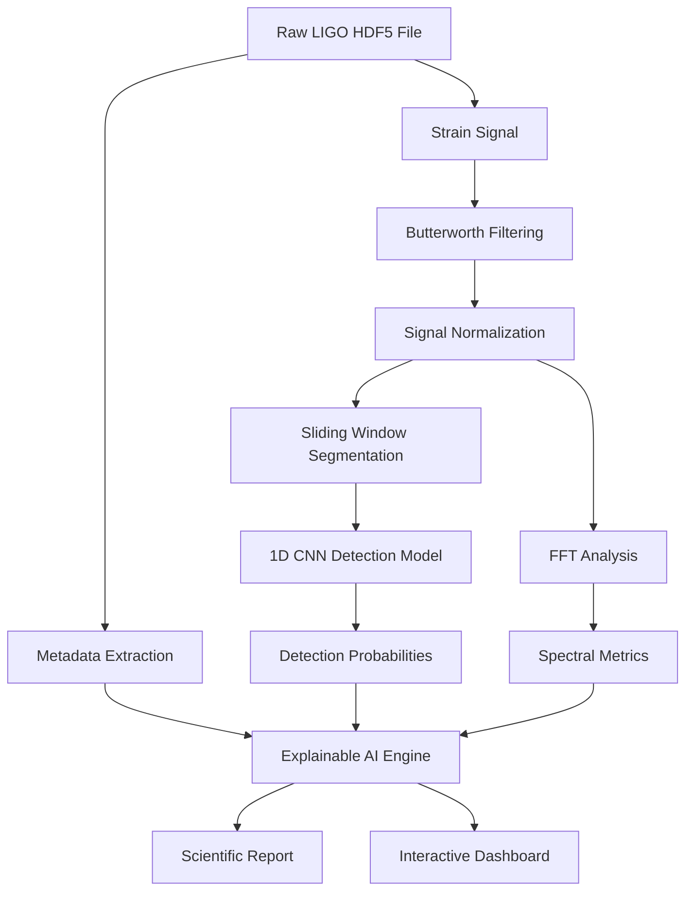

# 🌌 Explainable AI Gravitational-Wave Analysis System

[](https://www.python.org/)
[](https://streamlit.io/)
[](https://www.tensorflow.org/)
[](https://huggingface.co/)
[](LICENSE)

An interactive, scientific AI platform designed to analyze, visualize, and interpret gravitational-wave detector signals using deep learning, digital signal processing (DSP), and explainable AI (XAI) techniques.

Unlike traditional black-box classification models, this system bridges the gap between deep learning predictions and scientific understanding by generating interactive visual overlays, frequency spectra, and human-readable, context-aware scientific explanations powered by LLMs.

---

## 🚀 System Architecture & Workflow

The platform handles everything from raw detector telemetry to fully explained scientific results:



---

## ✨ Features

- **📡 Dual-Channel Visualization:** View and compare original noisy signals against filtered, noise-reduced waveforms in real time.
- **🧹 Advanced Signal Processing:** Interactive Butterworth low-pass filtering and min-max signal normalization to uncover transient astrophysical structures.
- **🌌 FFT Spectral Analysis:** Transform waveforms to the frequency domain to isolate dominant spectral peaks, identify detector noise, and inspect signal energy.
- **🧠 Localized 1D CNN Inference:** Slice signals into overlapping windows to identify the exact position of gravitational-wave chirps and plot probability time series.
- **🤖 LLM-Powered Explainable AI (XAI):** Generate contextual interpretations of analysis metrics (confidence, SNR, dominant frequency, FFT patterns, chirp characteristics) using Hugging Face's inference API (`Qwen/Qwen2.5-72B-Instruct`).
- **🕘 Analysis History Ledger:** Persist your findings locally in JSON and explore past runs with expandable detail panels.

---

## 📂 Codebase Directory Structure

```text
├── models/
│   ├── cnn_model.keras             # Trained Keras 1D CNN Model
│   └── cnn_metadata.json           # Model hyperparameter and accuracy metadata
├── history/                        # Saved analysis history ledgers (JSON files)
├── streamlit_app.py                # Core interactive Multi-page Web App
├── build_waveform_dataset.py       # Dataset assembler using real LIGO events
├── train_cnn.py                    # 1D CNN training pipeline
├── evalaute_model.py               # Model evaluation & performance metrics script
├── explore_file.py                 # LIGO HDF5 file recursive explorer utility
├── generate_fake_raw_hdf5.py       # Synthetic raw signal & glitch generator
├── test_api.py                     # Gemini API connectivity validator
└── requirements.txt                # Project dependencies
```

---

## 🛠️ Deep Dive: Code & Scripts

### 1. `streamlit_app.py`
The frontend and orchestration center. Features sidebar visualization parameters (FFT Scale, Max frequency sliders, filter strengths), interactive Plotly overlays, real-time inference, and automatic caching for quick file exploration.

### 2. `build_waveform_dataset.py`
Builds training datasets (`X.npy`, `y.npy`) from raw LIGO strain files. Slices positive regions (e.g., around `GW150914` or `GW170817`) and negative regions (background detector noise before and after the event) into overlapping sliding windows (size: 1024, step: 256).

### 3. `train_cnn.py`
Trains a high-performance 1D Convolutional Neural Network. Architecture includes:
- Multiple 1D Convolutional blocks with ReLU activations, Batch Normalization, and Max Pooling.
- Fully connected Dense layers with Dropout (0.4 and 0.3) to prevent overfitting.
- Adam Optimizer with learning rate decay schedules (`ReduceLROnPlateau`) and `EarlyStopping` monitoring validation loss.
- Automatically handles dataset imbalances by calculating class weights.

### 4. `evalaute_model.py`
Loads the trained Keras model and evaluates its confusion matrix, precision, recall, F1-score, and accuracy on test splits under specific confidence thresholds.

### 5. `generate_fake_raw_hdf5.py`
Generates a highly challenging synthetic dataset (`fake_raw_signal.hdf5`) containing a normalized gravitational wave corrupted by:
- Strong Gaussian noise.
- Low-frequency drifts (sine-drift simulating seismic noise).
- High-frequency oscillations.
- Discontinuous random amplitude glitches (simulating instrument glitches).
Perfect for validating the robustness of your noise-reduction filters and CNN.

---

## ⚙️ Installation & Setup

### Prerequisite: Python
Make sure you have Python 3.9 or higher installed.

### 1. Clone the Repository
```bash
git clone https://github.com/your-username/explainable-gw-ai.git
cd explainable-gw-ai
```

### 2. Install Dependencies
```bash
pip install -r requirements.txt
```

### 3. Configure your API Keys
The system can leverage Hugging Face or Gemini to explain your detections.
- **Hugging Face Inference (Default):** Open `streamlit_app.py` and replace `"YOUR_HF_TOKEN_HERE"` on line 33 with your Hugging Face API Token.
- **Gemini API:** Configure the API key in `test_api.py` if using Google's models.

### 4. Run the Streamlit Application
```bash
streamlit run streamlit_app.py
```

---

## 🔬 Getting LIGO Strain Data

To test the detector with real astrophysical events, download HDF5 strain files directly from the **Gravitational Wave Open Science Center (GWOSC)**:
1. Navigate to [GWOSC](https://www.gw-openscience.org).
2. Select classic events such as **GW150914** (First binary black hole merger) or **GW170817** (First binary neutron star merger).
3. Download the 4096 Hz `.hdf5` strain files.
4. Upload them directly in the **Upload & Detect** tab of the Streamlit App!

---

## 🔬 Scientific Disclaimer & Limitations

> [!WARNING]
> This system is an **educational and research prototype** designed to demonstrate explainable AI and signal processing concepts. It is **not** an official scientific LIGO verification pipeline.
> 
> Deep learning confidence scores and localized neural detections should not be treated as absolute astrophysical confirmations. Confirmed detections require multi-detector coincidence (LIGO Hanford, LIGO Livingston, Virgo, KAGRA), exhaustive statistical modeling, and rigorous peer review.
